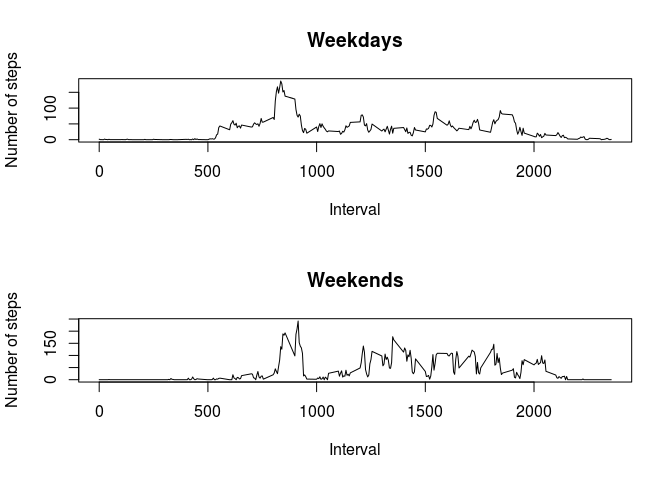

# Reproducible Research: Peer Assessment 1


## Loading and preprocessing the data


```r
activity <- read.csv("activity.csv", colClasses = c("numeric", "factor" , "numeric"))
activity$date <- as.Date(strptime(activity$date, "%Y-%m-%d"))
```

## What is mean total number of steps taken per day?


```r
library(ggplot2)
ggplot(activity, aes(x=date,y=steps)) + geom_histogram(stat="identity")
```

```
## Warning: Removed 2304 rows containing missing values (position_stack).
```

 

```r
means_table <- aggregate(list (steps=activity$steps[!is.na(activity$steps)]), by = list (date=activity$date[!is.na(activity$steps)]), mean, na.rm=TRUE)
medians_table <- aggregate(list (steps=activity$steps[!is.na(activity$steps)]), by = list (date=activity$date[!is.na(activity$steps)]), median, na.rm=TRUE)
means_table
```

```
##          date      steps
## 1  2012-10-02  0.4375000
## 2  2012-10-03 39.4166667
## 3  2012-10-04 42.0694444
## 4  2012-10-05 46.1597222
## 5  2012-10-06 53.5416667
## 6  2012-10-07 38.2465278
## 7  2012-10-09 44.4826389
## 8  2012-10-10 34.3750000
## 9  2012-10-11 35.7777778
## 10 2012-10-12 60.3541667
## 11 2012-10-13 43.1458333
## 12 2012-10-14 52.4236111
## 13 2012-10-15 35.2048611
## 14 2012-10-16 52.3750000
## 15 2012-10-17 46.7083333
## 16 2012-10-18 34.9166667
## 17 2012-10-19 41.0729167
## 18 2012-10-20 36.0937500
## 19 2012-10-21 30.6284722
## 20 2012-10-22 46.7361111
## 21 2012-10-23 30.9652778
## 22 2012-10-24 29.0104167
## 23 2012-10-25  8.6527778
## 24 2012-10-26 23.5347222
## 25 2012-10-27 35.1354167
## 26 2012-10-28 39.7847222
## 27 2012-10-29 17.4236111
## 28 2012-10-30 34.0937500
## 29 2012-10-31 53.5208333
## 30 2012-11-02 36.8055556
## 31 2012-11-03 36.7048611
## 32 2012-11-05 36.2465278
## 33 2012-11-06 28.9375000
## 34 2012-11-07 44.7326389
## 35 2012-11-08 11.1770833
## 36 2012-11-11 43.7777778
## 37 2012-11-12 37.3784722
## 38 2012-11-13 25.4722222
## 39 2012-11-15  0.1423611
## 40 2012-11-16 18.8923611
## 41 2012-11-17 49.7881944
## 42 2012-11-18 52.4652778
## 43 2012-11-19 30.6979167
## 44 2012-11-20 15.5277778
## 45 2012-11-21 44.3993056
## 46 2012-11-22 70.9270833
## 47 2012-11-23 73.5902778
## 48 2012-11-24 50.2708333
## 49 2012-11-25 41.0902778
## 50 2012-11-26 38.7569444
## 51 2012-11-27 47.3819444
## 52 2012-11-28 35.3576389
## 53 2012-11-29 24.4687500
```

```r
medians_table
```

```
##          date steps
## 1  2012-10-02     0
## 2  2012-10-03     0
## 3  2012-10-04     0
## 4  2012-10-05     0
## 5  2012-10-06     0
## 6  2012-10-07     0
## 7  2012-10-09     0
## 8  2012-10-10     0
## 9  2012-10-11     0
## 10 2012-10-12     0
## 11 2012-10-13     0
## 12 2012-10-14     0
## 13 2012-10-15     0
## 14 2012-10-16     0
## 15 2012-10-17     0
## 16 2012-10-18     0
## 17 2012-10-19     0
## 18 2012-10-20     0
## 19 2012-10-21     0
## 20 2012-10-22     0
## 21 2012-10-23     0
## 22 2012-10-24     0
## 23 2012-10-25     0
## 24 2012-10-26     0
## 25 2012-10-27     0
## 26 2012-10-28     0
## 27 2012-10-29     0
## 28 2012-10-30     0
## 29 2012-10-31     0
## 30 2012-11-02     0
## 31 2012-11-03     0
## 32 2012-11-05     0
## 33 2012-11-06     0
## 34 2012-11-07     0
## 35 2012-11-08     0
## 36 2012-11-11     0
## 37 2012-11-12     0
## 38 2012-11-13     0
## 39 2012-11-15     0
## 40 2012-11-16     0
## 41 2012-11-17     0
## 42 2012-11-18     0
## 43 2012-11-19     0
## 44 2012-11-20     0
## 45 2012-11-21     0
## 46 2012-11-22     0
## 47 2012-11-23     0
## 48 2012-11-24     0
## 49 2012-11-25     0
## 50 2012-11-26     0
## 51 2012-11-27     0
## 52 2012-11-28     0
## 53 2012-11-29     0
```


## What is the average daily activity pattern?

```r
means2_table <- aggregate(list (steps=activity$steps[!is.na(activity$steps)]), by = list (interval=activity$interval[!is.na(activity$steps)]), mean, na.rm=TRUE)
plot(means2_table$interval, means2_table$steps, type="l", ylab="Mean steps", xlab="Interval")
```

 

```r
max = means2_table$interval[means2_table$steps==max(means2_table$steps)]
paste("The 5-minute interval, on average across all the days in the dataset, that contains the maximum number of steps is :", max)
```

```
## [1] "The 5-minute interval, on average across all the days in the dataset, that contains the maximum number of steps is : 835"
```

## Imputing missing values

```r
#sapply(activity, function(x) sum(is.na(x)))
#activity$steps <- with(activity, ifelse(is.na(steps)), means_table$steps[means_table$data==date])
#  
#  
#list_dates_when_na <- table(activity$date[is.na(activity$steps)])
#with(list_dates_when_na, function(x) means_table$steps[means_table$date==as.Date(strptime(x, "%Y-%m-%d"))])
#
#with(list_dates_when_na, function(x) x)
```
## Are there differences in activity patterns between weekdays and weekends?

```r
activity$day <- as.POSIXlt(activity$date)$wday
subset_weekdays <- sub <- subset(activity, day <= 5)
subset_weekends <- sub <- subset(activity, day >= 6)
means2_weekdays <- aggregate(list (steps=subset_weekdays$steps[!is.na(subset_weekdays$steps)]), 
      by = list (interval=subset_weekdays$interval[!is.na(subset_weekdays$steps)]), mean, na.rm=TRUE)
means2_weekends <- aggregate(list (steps=subset_weekends$steps[!is.na(subset_weekends$steps)]),
      by = list (interval=subset_weekends$interval[!is.na(subset_weekends$steps)]), mean, na.rm=TRUE)
par(mfrow = c(2,1)) 
plot(means2_weekdays$interval, means2_weekdays$steps, type="l", ylab="Number of steps", xlab="Interval", main="Weekdays")
plot(means2_weekends$interval, means2_weekends$steps, type="l", ylab="Number of steps", xlab="Interval", main="Weekends")
```

 

